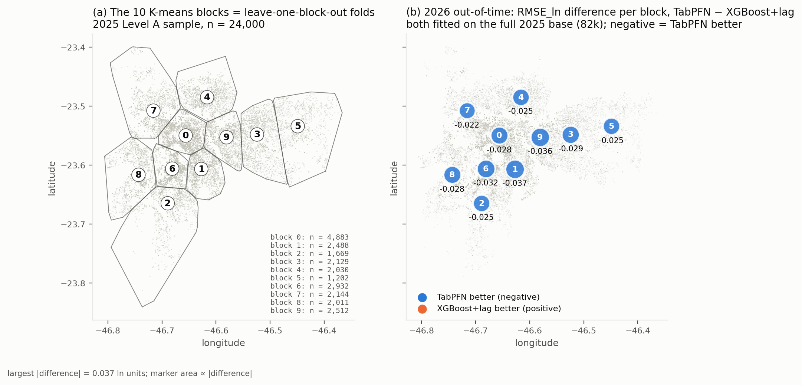
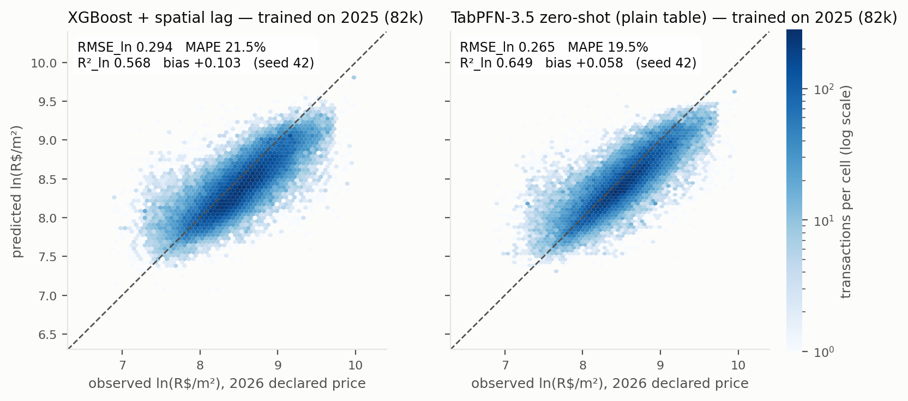
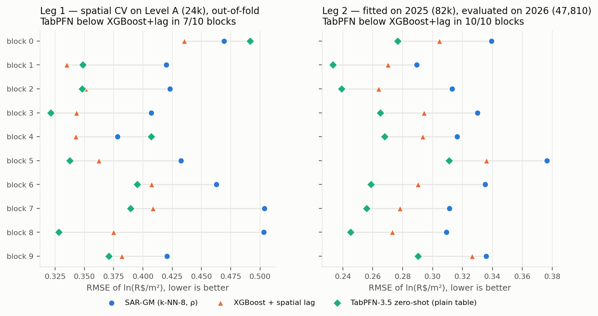
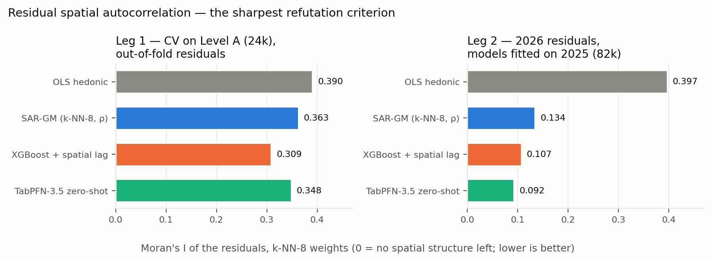
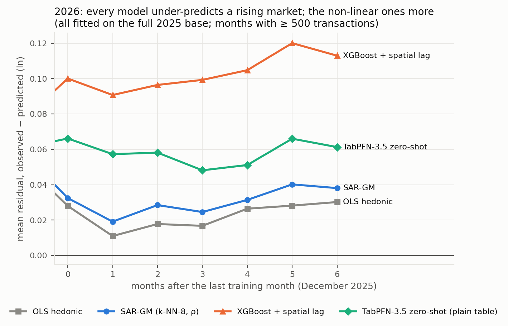

# Mass Appraisal of São Paulo Real Estate with TabPFN-3.5

**Prior Labs TabPFN-3.5 Hackathon entry** — spatial machine learning on
**82,187 actual transaction prices** from the São Paulo ITBI — *Imposto
sobre Transmissão de Bens Imóveis*, the Brazilian municipal tax on real
estate transfers (real-estate transfer tax) — with an out-of-time test on
47,810 transactions from 2026.

## Why this matters

Mass appraisal in Brazil (and in most of the world) still relies on linear
hedonic and spatial econometric models. A previous study by the author —
awarded at the CEAD 2026 congress — compared OLS, SAR, SEM, PS-SAR and
TabPFN v3 on 5,005 apartment *listings* in Belo Horizonte, with TabPFN
winning out-of-sample. This project raises the bar in four ways:

1. **Actual prices, not listings**: ITBI forms record what buyers declared
   they paid, month by month, for the whole city of São Paulo.
2. **Scale**: 82k training records across three property types
   (apartment / house / commercial), with a 24k stratified sample
   ("Level A") for a three-model comparison — SAR (spatial econometrics),
   XGBoost with spatial features (gradient boosting) and **TabPFN-3.5**
   — and the full base ("Level B") for TabPFN-3.5 alone.
3. **Honest evaluation**: spatial block cross-validation (K-means, k=10),
   out-of-time testing (train on 2025, predict 2026), multiple seeds,
   Moran's I of residuals, paired Wilcoxon + block bootstrap.
4. **Practice-ready outputs**: predictive distributions → 80% prediction
   intervals per property → empirical coverage and precision grading under
   the Brazilian appraisal standard **NBR 14653-2**, plus traceable
   comparables (which training rows drive each prediction) and SHAP values.

## Central hypothesis (stated so that it can fail)

> A tabular foundation model that receives only the property attributes and
> the coordinates as two ordinary numeric columns — **no spatial weights
> matrix, no spatial lag, no engineered neighbourhood features** — predicts
> spatially correlated prices as well as, or better than, specialised models
> that encode spatial dependence explicitly.

The comparison is deliberately asymmetric *against* the hypothesis. The
baselines keep every spatial advantage: the SAR lag model has its k-NN
weights matrix and ρ; XGBoost gets a fold-internal k-NN-8 spatial lag,
rotated coordinate axes and nested Optuna tuning. **TabPFN-3.5 gets the
plain table** (built and lot area, age, finish grade, distance to the
nearest station, month, property type, latitude, longitude) and is run
zero-shot and in thinking mode. If it matches or beats the specialists, the
result cannot be attributed to a weakened baseline.

Refutation criteria, all from the same protocol: worse pooled RMSE/MAPE;
losses in most spatial blocks (paired Wilcoxon, block bootstrap); and, the
sharpest, **more spatial autocorrelation left in its out-of-fold residuals
(Moran's I)** than the explicitly spatial models leave in theirs.

## Glossary of Brazilian terms

Portuguese terms appear throughout the source data; every one used in this
repository is translated here and at first mention in each document.

| Term | Meaning |
|---|---|
| ITBI (*Imposto sobre Transmissão de Bens Imóveis*) | Municipal tax on real-estate transfers (real-estate transfer tax); its paid forms ("guias") record declared transaction prices |
| IPTU (*Imposto Predial e Territorial Urbano*) | Annual municipal property tax; source of the physical attributes (areas, use, standard, completion year) |
| SQL (*Setor, Quadra, Lote*) | 11-digit cadastral key: sector (3) + block (3) + lot (4) + check digit (1) |
| VVR (*Valor Venal de Referência*) | Municipal reference assessed value; the ITBI tax base is max(declared price, VVR) |
| ACC (*Ano de Construção Corrigido*) | Corrected construction-completion year from the IPTU register |
| Quadra fiscal | Fiscal block — the city-block polygon of the cadastre (GeoSampa layer) |
| Guia | The individual tax form; one paid form = one transaction record |
| SFH / MCMV (*Sistema Financeiro de Habitação / Minha Casa Minha Vida*) | Housing-finance system / federal affordable-housing programme (financing categories) |
| NBR 14653-2 | Brazilian valuation standard for urban properties (precision grading used here) |
| GeoSampa | Open geoportal of the São Paulo City Hall (*Prefeitura de São Paulo*) |

## Data

All data is public. See [`DATA_NOTICE.md`](DATA_NOTICE.md) for sources,
download dates and terms. Raw files keep their original Portuguese names as
downloaded from the official São Paulo City Hall sites (provenance);
English-labelled convenience copies are provided under `data/english/`.

| File | Content |
|---|---|
| `data/raw/GUIAS DE ITBI PAGAS 2025 XLS.xlsx` | 230,525 ITBI forms paid in 2025 (12 monthly sheets + documentation sheets) |
| `data/raw/GUIAS DE ITBI PAGAS 2026 XLS.xlsx` | 135,655 ITBI forms paid Jan–Jul 2026 |
| `data/raw/quadra_fiscal_p*.gpkg` | 64,223 fiscal-block polygons (GeoSampa WFS, EPSG:31983) |
| `data/raw/estacao_metro.geojson`, `estacao_trem.geojson` | 203 subway and commuter-rail stations |
| `data/fiscal_block_centroids.csv`, `data/fiscal_block_lookup.csv` | derived block centroids (pipeline step 01) |
| `data/itbi_sp_2025_train.csv.gz` | cleaned 2025 training base (82,187 rows; gzipped, read directly by pandas) |
| `data/itbi_sp_2026_test.csv` | cleaned 2026 out-of-time test base (47,810 rows) |
| `data/itbi_sp_2025_level_a.csv` | stratified 24,000-row sample for the 3-model comparison |
| `data/english/*_en.csv` | same datasets with English column headers (convenience copies — **not** the originals; see DATA_NOTICE.md) + `column_mapping.csv` |

Cleaning decisions are fully documented with per-step record counts in
[`data/filter_report.md`](data/filter_report.md); column semantics in
[`data/data_dictionary.md`](data/data_dictionary.md). A notable step:
because the São Paulo ITBI tax base is max(declared price, assessed
reference value), under-declared prices bunch exactly at the assessed value —
we detect and remove that bunching for cash purchases (financed deals are
lender-audited); see
[`data/underdeclaration_report.md`](data/underdeclaration_report.md).

## Reproducing

```bash
pip install -r requirements.txt

# 1. fiscal-block centroids from the GeoSampa GPKG pages
python pipeline/01_fiscal_block_centroids.py

# 2. cleaning: raw workbooks -> train/test/level_a CSVs + reports
python pipeline/02_itbi_cleaning.py

# 3. under-declaration diagnostics (residual picture)
python pipeline/03_underdeclaration_diagnostics.py

# 4. English-labelled convenience copies (data/english/)
python pipeline/04_english_labels.py

# 5. evaluation-protocol smoke test (trivial baseline through the full
#    machinery: spatial-block CV, metrics, Moran's I) — no API credits used
python -m src.protocol --data data/itbi_sp_2025_level_a.csv --smoke

# 6. baselines on Level A (spatial-block CV; results/cv_*.json + oof_*.csv)
python -m src.model_sar --estimator ols                 # OLS hedonic
python -m src.model_sar                                 # SAR lag (GM_Lag)
python -m src.model_xgb --seeds 42 43 44                # XGBoost + spatial features (~70 min, 2 vCPU)
python -m src.model_xgb --no-lag --seeds 42 43 44       # ablation without the k-NN lag

# 7. TabPFN-3.5, no explicit spatial modelling (needs an API key: export TABPFN_TOKEN=...)
bash scripts/10_tabpfn_level_a.sh check                 # token, models, allowance, cost estimates (no quota)
bash scripts/10_tabpfn_level_a.sh t0                    # zero-shot, + paired tests vs SAR / XGB / OLS
bash scripts/10_tabpfn_level_a.sh t0-think              # thinking mode (medium)

# 8. out-of-time: fit on 2025, predict 2026 (baselines here, TabPFN via API)
python -m src.out_of_time --model ols --train level_a
python -m src.out_of_time --model sar --train level_a
python -m src.out_of_time --model xgb --train level_a --seeds 42 43 44
bash scripts/20_tabpfn_out_of_time.sh t0 && bash scripts/20_tabpfn_out_of_time.sh compare

# 9. figures from the versioned results (results/figures/; no model is re-run)
python -m src.make_figures

# 10. SHAP on a small sample of 2026 properties (model reloaded from the cache, no refit; API)
bash scripts/30_tabpfn_shap.sh smoke                    # pipeline test with a local mock model, no API
bash scripts/30_tabpfn_shap.sh run && python -m src.make_figures --shap

# 11. robustness: financed transactions only, both legs
bash scripts/40_financed_robustness.sh baselines        # OLS, SAR, XGB+lag (no API)
bash scripts/40_financed_robustness.sh tabpfn           # TabPFN-3.5 zero-shot (API)
bash scripts/40_financed_robustness.sh compare
```

TabPFN-3.5 responses are cached under `results/tabpfn_cache/<label>/`, so
the protocol can be re-run offline from the cached predictions. The TabPFN
runs use their own environment (`requirements-tabpfn.txt`, because
`tabpfn-client` pins pandas ≤ 2.3.3); they were executed on macOS with
Python 3.14 and the baselines on Linux with Python 3.11.

All seeds are fixed (42, plus 43/44 where a model is stochastic); no
downloads or geocoding APIs are called at runtime.

**Clean-clone check (2026-09-28).** The steps above that need no API key
were run from a fresh `git clone` on Linux/Python 3.11: `pip install -r
requirements.txt`, then step 2 rebuilt the three bases from the raw
workbooks and they came out **byte-identical** to the versioned files
(82,187 / 47,810 / 24,000 rows; `filter_report.md` and
`data_dictionary.md` identical too), steps 3 and 4 reproduced their
reports, the step-5 smoke test returned the documented numbers
(RMSE_ln 0.4971, Moran's I 0.446) and the OLS baseline of step 6
regenerated `results/cv_ols_2025_level_a.json` byte-identically.

## Results so far — Level A (24,000 rows, leave-one-block-out CV, 10 blocks)

Out-of-fold metrics on the 2025 base; ln = natural log of the unit price
(R$/m²). Moran's I is computed on the out-of-fold residuals with a k-NN-8
weights matrix (higher = more spatial structure left unexplained).



*Figure 1. (a) The ten K-means blocks of the Level A sample, each held out
in turn as a test fold; (b) the same map with the 2026 out-of-time RMSE_ln
difference TabPFN − XGBoost+lag per block (both fitted on the full 2025
base) — negative everywhere.*

| Model | RMSE (ln) | MAPE | R² (ln) | Moran's I of residuals |
|---|---|---|---|---|
| Median by property type (floor) | 0.497 | 42.1% | −0.04 | 0.446 |
| OLS hedonic | 0.470 | 39.4% | 0.066 | 0.390 |
| SAR lag, GM_Lag (ρ = 0.91) | 0.448 | 38.4% | 0.155 | 0.363 |
| XGBoost + rotated coordinates (no lag; ablation) | 0.397 (3 seeds: 0.395–0.397) | 33.3% | 0.334 | 0.355 |
| **XGBoost + rotated coordinates + k-NN-8 lag** | **0.385** (3 seeds: 0.384–0.387) | **32.3%** | **0.376** | 0.309 |
| **TabPFN-3.5, plain table, zero-shot** (no spatial modelling) | 0.394 (3 seeds: 0.390–0.394) | 32.2% | 0.346 | 0.348 |
| **TabPFN-3.5, plain table, thinking mode (medium)** | 0.389 | **31.7%** | 0.362 | 0.342 |
| TabPFN-3.5, plain table, thinking mode (high) | 0.388 | **31.7%** | 0.366 | 0.339 |

Paired tests (`results/compare_*.json`, seed 42): SAR vs OLS improves the
pooled RMSE by 0.023 but **not consistently** across folds (wins 6 of 10
blocks, Wilcoxon p = 0.63, block-bootstrap 95% CI crosses zero). XGBoost with
the spatial lag beats SAR in **10 of 10 blocks** (Wilcoxon p = 0.002; pooled
ΔRMSE_ln = −0.063, block-bootstrap 95% CI [−0.086, −0.046]; ΔMAPE = −6.1 pp
[−8.3, −4.1]). Within XGBoost, the explicit k-NN-8 lag is worth ΔRMSE_ln =
−0.013 [−0.024, −0.004] (wins 7 of 10 blocks, Wilcoxon p = 0.027) and cuts
the residual Moran's I from 0.355 to 0.309 — the price of *not* modelling
space explicitly, for a strong tree learner that already sees the
coordinates.

**Where the central hypothesis stands (Level A).** TabPFN-3.5 with the
plain table — nine raw columns, coordinates as two numbers, zero-shot, ten
seconds per fold — beats the SAR lag model in 8 of 10 blocks (ΔRMSE_ln =
−0.054, block-bootstrap 95% CI [−0.100, −0.014], Wilcoxon p = 0.010; ΔMAPE
= −6.2 pp) and is **statistically indistinguishable from the fully
spatial XGBoost** (ΔRMSE_ln = +0.009 [−0.018, +0.034]; ΔMAPE = −0.1 pp
[−3.7, +3.8]; wins 7 of 10 blocks, loses clearly in the largest one).
Thinking mode (medium effort, ~100 s per fold) improves it slightly and
consistently (ΔRMSE_ln vs zero-shot = −0.005 [−0.008, −0.001]) and gives
the lowest MAPE in the table; high effort costs ~13× more per fold and adds
nothing beyond noise. On the sharpest criterion the hypothesis is **partly
refuted** in this leg: the residual Moran's I of TabPFN (0.348 zero-shot,
0.342 thinking) is below SAR's (0.363) but above that of XGBoost with the
explicit lag (0.309) — without seeing space, the foundation model leaves
more spatial structure unexplained than the specialist that models it,
while matching its point-prediction error.

Errors are much larger than in the Belo Horizonte listings
study (R² 0.54 there) — expected with *declared* prices, three property
types and fiscal-block-centroid coordinates — and every model still leaves
substantial spatial autocorrelation in its residuals, which is the bar set
for TabPFN-3.5.

## Results — out-of-time: fit on 2025, predict the 47,810 transactions of 2026

The second leg of the protocol (`src/out_of_time.py`): one fit on the 2025
base, predictions for every cleaned 2026 transaction (one to seven months
after the training window; `mes_idx` 13–19 vs 1–12). Nothing from 2026
touches fitting or tuning. Unlike the block CV, this test is *inside*
space — the 2026 properties sit in the same blocks as the training data,
one year later — so errors are lower for everyone and the spatial-lag
models get neighbours from the same streets: the most favourable setting
for explicit spatial modelling. Moran's I is on a k-NN-8 matrix of the
2026 coordinates; "bias" is the mean residual in ln (positive = prices
under-predicted).

| Model (trained on Level A, 24,000 rows) | RMSE (ln) | MAPE | R² (ln) | Bias (ln) | Moran's I |
|---|---|---|---|---|---|
| OLS hedonic | 0.404 | 32.4% | 0.185 | +0.033 | 0.408 |
| SAR lag, GM_Lag | 0.346 | 27.0% | 0.401 | +0.033 | 0.224 |
| XGBoost + rotated coordinates + k-NN-8 lag | 0.288 (3 seeds: ±0.000) | 21.8% | 0.584 | +0.047 | 0.140 |
| **TabPFN-3.5, plain table, zero-shot** (fit in 9 s) | **0.275** | **20.4%** | **0.622** | +0.055 | **0.122** |
| TabPFN-3.5, plain table, thinking (medium) | 0.275 | 20.5% | 0.621 | +0.055 | 0.121 |

| Model (trained on the full 2025 base, 82,187 rows) | RMSE (ln) | MAPE | R² (ln) | Bias (ln) | Moran's I |
|---|---|---|---|---|---|
| OLS hedonic | 0.402 | 32.4% | 0.194 | +0.023 | 0.397 |
| SAR lag, GM_Lag | 0.326 | 25.0% | 0.470 | +0.031 | 0.134 |
| XGBoost + rotated coordinates + k-NN-8 lag | 0.287 (3 seeds: 0.280–0.294) | 21.0% | 0.59 | +0.07 to +0.10 | 0.105 |
| **TabPFN-3.5, plain table, zero-shot** (fit in 15 s) | **0.265** | **19.5%** | **0.649** | +0.058 | **0.092** |



*Figure 2. Predicted vs observed ln(R$/m²) on the 2026 transactions, both
models fitted on the full 2025 base (seed 42). The dashed line is the
identity; the cloud sitting above it is the under-prediction of a rising
market discussed below.*

Paired tests over the ten 2026 blocks (`results/oot_compare_*.json`,
`results/oot_paired_comparisons_level_a.csv`): TabPFN zero-shot vs XGBoost
with the explicit lag, ΔRMSE_ln = −0.013 [−0.016, −0.011], ΔMAPE = −1.4 pp
[−1.6, −1.2], **better in 10 of 10 blocks** (Wilcoxon p = 0.002) and with
*less* residual spatial autocorrelation (0.122 vs 0.140); vs SAR, ΔRMSE_ln
= −0.071 [−0.079, −0.062], ΔMAPE = −6.6 pp, half the residual Moran's I.
Thinking mode adds nothing here (ΔRMSE_ln = +0.0003). On the full base the
gap widens (`results/oot_paired_comparisons_full.csv`): TabPFN vs XGBoost
ΔRMSE_ln = −0.029 [−0.032, −0.026], ΔMAPE = −2.0 pp, 10 of 10 blocks, and
the lowest residual Moran's I of any model (0.092). Going from 24k to 82k
training rows improves TabPFN by −0.010 [−0.012, −0.008] and SAR by −0.020,
while XGBoost does not improve (+0.006 [+0.001, +0.011]) because its
trend-extrapolation bias doubles and eats the variance gain. In this leg
the hypothesis survives every criterion, at both scales, including the
residual one.

Leakage check before believing it: zero identical transactions (same
cadastral key, date and price) between the 2026 test and any 2025 base;
0.6% of the 2026 rows share a cadastral key (same lot or building) with
Level A. Errors are flat across blocks (0.25–0.32) and across horizons of
one to seven months (0.26–0.29), so the result is not driven by a subset.



*Figure 3. RMSE_ln per spatial block: leave-one-block-out CV on Level A
(left; TabPFN below XGBoost+lag in 7 of 10 blocks, a statistical tie) and
the 2026 out-of-time test with the full 2025 base (right; 10 of 10).*



*Figure 4. Residual Moran's I on a k-NN-8 matrix. Left: the partial
refutation — in the block CV the plain-table TabPFN leaves more spatial
structure than XGBoost with the explicit lag. Right: inside space and one
year ahead, it leaves the least of all four.*



*Figure 5. Mean residual (observed − predicted, ln) by month after the end
of the training window, models fitted on the full 2025 base.*

**Limitation worth stating.** Every model under-predicts 2026 (prices
rose), and the two non-linear learners more so (TabPFN +0.055–0.058,
XGBoost +0.05 on Level A and +0.07–0.10 on the full base, vs +0.02–0.03 for
the linear models): trees and TabPFN hold the last observed level of the
month index instead of extrapolating a trend. For appraisal practice this calls
for a trend or index adjustment; it is reported, not corrected, here.

**Why XGBoost with spatial features rather than G-XGBoost.** Geographically
weighted XGBoost (`geoxgboost`, one of the methods of the reference study)
was piloted and timed (`src/pilot_gxgb_timing.py`,
`results/gxgb_timing_pilot.json`): it fits one local model per training row
and per bandwidth candidate over a dense n × n distance matrix, which at
~20k rows per fold means ~0.5 h per bandwidth candidate, ~2 days for a
modest grid, and 2.9 GB of distance matrix per fold. The scalable substitute
keeps the idea of letting the learner see space: a fold-internal k-NN-8
spatial-lag feature (leave-one-out for training rows), UTM coordinates plus
30°/45°/60° rotations, the same hedonic block as SAR/OLS, and **nested**
Optuna tuning (inner leave-one-block-out on the training blocks; the outer
test block never touches tuning). Details in `src/model_xgb.py`.

## Repository layout

```
data/raw/      original public files as downloaded (see DATA_NOTICE.md)
data/          derived datasets and data reports
pipeline/      data preparation scripts (01–04)
src/           evaluation protocol and models (protocol, SAR/OLS, XGBoost, TabPFN-3.5)
scripts/       TabPFN-3.5 API runs (executed on a machine with API access; outputs cached in results/)
notebooks/     exploratory analyses
results/       metrics (cv_*.json, oot_*.json), out-of-fold / hold-out predictions, paired tests,
               TabPFN response cache, SHAP values (results/shap/), figures (results/figures/)
app/           Streamlit demo ("Avaliador SP")
paper/         reference paper (English translation forthcoming)
```

## Roadmap

- [x] Data pipeline with documented filter chain and georeferencing
- [x] Evaluation protocol (`src/protocol.py`): spatial-block CV, metrics,
      Moran's I, Wilcoxon + block bootstrap, multi-seed CIs
- [x] Baselines on Level A: OLS, SAR lag (`spreg` GM_Lag), XGBoost with
      spatial features (nested Optuna); G-XGBoost feasibility pilot
- [x] TabPFN-3.5 on the plain table: zero-shot, thinking (medium, high),
      three seeds, paired against the explicitly spatial baselines
- [x] Out-of-time test 2025 → 2026 (Level A training)
- [x] Full 2025 base (82k) out-of-time, all four models
- [x] Figures from the versioned results (`src/make_figures.py`)
- [ ] SHAP on a small sample of 2026 properties (`src/shap_tabpfn.py`; script
      and samples in place, API run pending)
- [ ] Financed-only robustness run, both legs (`scripts/40_financed_robustness.sh`;
      OLS and SAR done, XGBoost and TabPFN runs pending); block-grouped thinking
- [ ] Optional extensions beyond the core claim: high-cardinality location
      labels, text fields
- [ ] Streamlit app and 2–3 min video

## License

Code and documentation under [Apache 2.0](LICENSE). Data notices in
[`DATA_NOTICE.md`](DATA_NOTICE.md). To cite this work, see
[`CITATION.cff`](CITATION.cff).

## Author

**Agnaldo Calvi Benvenho** — mechanical engineer (POLI-USP, Polytechnic
School of the University of São Paulo), MSc in Appraisal Engineering
(Universidad Politécnica de Valencia), Certification Director at IBAPE
Nacional (*Instituto Brasileiro de Avaliações e Perícias de Engenharia* —
Brazilian Institute of Engineering Appraisals and Expert Examinations),
court-appointed expert at the São Paulo State Court (TJSP). Code developed
with AI assistance (Claude); all methodological decisions by the author.
