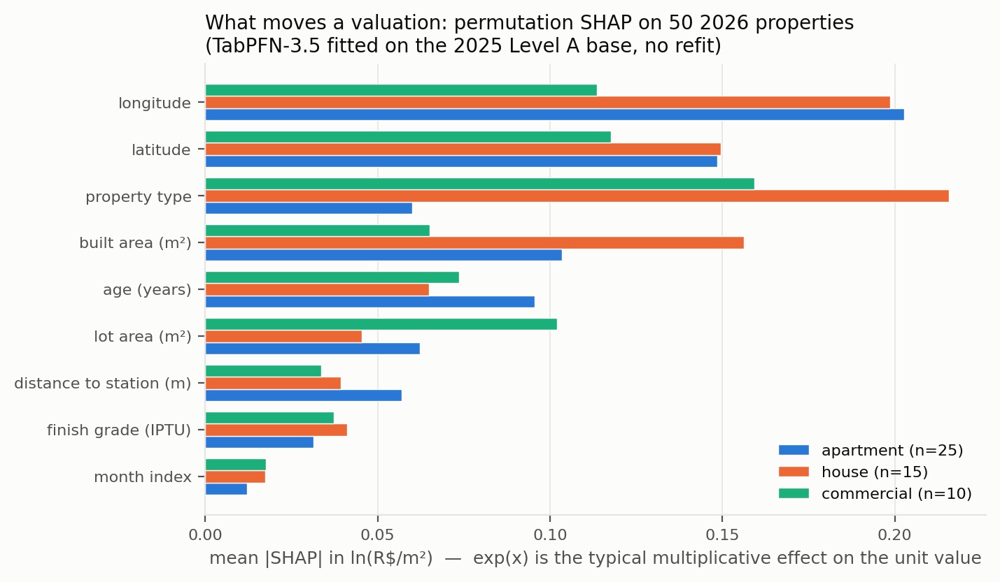
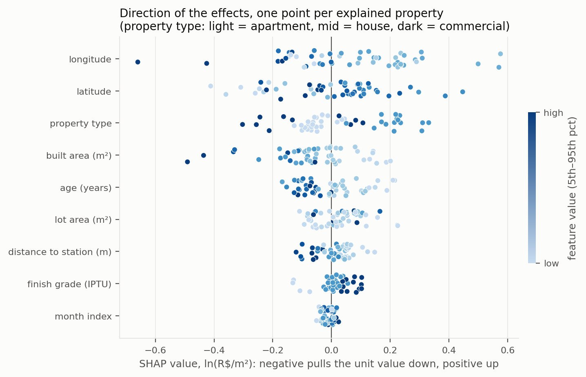
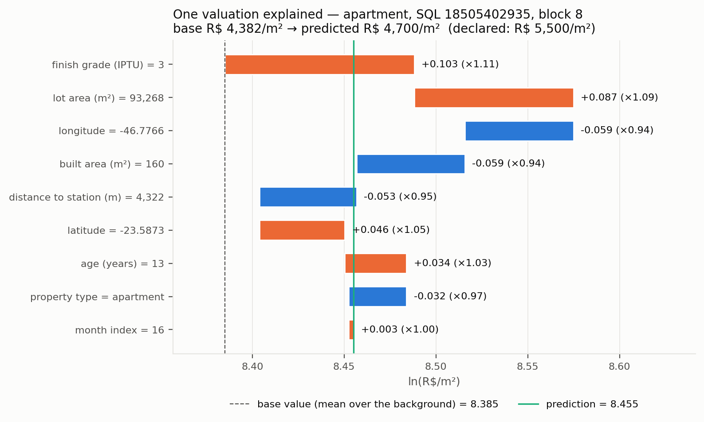

# Further tests: full write-up

Companion to the [README](../README.md), which states the conclusions and reports the two main
tests. The six further tests are written up here in full, as they were run: tables, mechanism checks
and, where they were recorded, the expectations written in `src/model_tabpfn.py`
before the run. The README summarises each
one under [Further tests](../README.md#further-tests).

* [Explaining an estimate — SHAP on 50 properties](#explaining-an-estimate--shap-on-50-properties)
* [Robustness — financed deals only](#robustness--financed-deals-only)
* [Ablation — the address as well as the coordinates](#ablation--the-address-as-well-as-the-coordinates)
* [Spatial analysis from a ZIP code](#spatial-analysis-from-a-zip-code)
* [Text variant — the unit and the building as written](#text-variant--the-unit-and-the-building-as-written)
* [Thinking with the blocks as groups](#thinking-with-the-blocks-as-groups)

## Explaining an estimate — SHAP on 50 properties

An appraiser who signs a valuation has to say why. The model is served through an API, so the
explanation is model-agnostic permutation SHAP (`shap.PermutationExplainer`, independent masker,
20-row background), run on the zero-shot model reloaded from its cached record — no refit — for 50
stratified 2026 transactions it had never seen. 27,217 predicted rows in total, every call cached under
`results/shap/cache/`, so the attributions are reproducible offline. Values are in ln; `exp(SHAP)` is
the multiplier on R$/m².

*Figures 6–8. Mean |SHAP| per feature; direction of the effects; one valuation from base value to
estimate, as an appraiser would read it.*

Longitude (mean |SHAP| 0.184, a typical ×1.20 on the unit value) and latitude (0.143, ×1.15) are the
two strongest inputs, ahead of property type (0.127), built area (0.112) and age (0.082). That is the
bet seen from inside the model: the two raw coordinates carry the spatial signal the baselines have
to encode with a weights matrix. What they carry is location rather than geometry: with a
[raw postal code in their place](#spatial-analysis-from-a-zip-code) the model loses almost nothing
inside the market it has seen. Directions are the ones an appraiser expects: older buildings and
longer walks to a station pull the unit value down, higher finish grades push it up, larger built
areas lower the price per square metre.

## Robustness — financed deals only

Financed transactions carry a bank appraisal and are the cleanest prices in the base. Both legs were
re-run on that subset alone: 7,211 of the 24,000 Level A rows for the block CV, the same rows fitted
once and scored on the 20,052 financed transactions of 2026 (`scripts/40_financed_robustness.sh`,
`results/*_fin*`).

| Model | CV RMSE (ln) | CV MAPE | CV Moran's I | 2026 RMSE (ln) | 2026 MAPE | 2026 Moran's I |
|---|---|---|---|---|---|---|
| OLS hedonic | 0.354 | 28.5 % | 0.343 | 0.343 | 26.5 % | 0.491 |
| SAR lag | 0.344 | 28.1 % | 0.342 | 0.286 | 22.0 % | 0.297 |
| XGBoost + rotated coordinates + k-NN-8 lag | 0.286 | 23.0 % | 0.327 | 0.221 | 16.7 % | 0.160 |
| **TabPFN-3.5, plain table, zero-shot** | **0.269** | **21.1 %** | **0.279** | **0.207** | **15.3 %** | **0.143** |

Cleaner prices, lower errors for everyone, the same ranking one year ahead, and the plain-table model does better here
than in the main analysis on every criterion: block CV vs XGBoost+lag ΔRMSE −0.017 [−0.032, −0.003],
p = 0.049, 8 of 10 blocks (a tie on the full Level A); 2026 vs XGBoost −0.013 [−0.017, −0.010], 10 of
10. The partial refutation from the block CV does not reappear: on financed deals TabPFN leaves less
spatial structure than XGBoost+lag in both legs. Nothing in the headline results depends on the cash
deals; if anything, the noisier cash prices are where the explicitly spatial learner holds its own.

## Ablation — the address as well as the coordinates

The ITBI form states location twice: as the coordinates the main analysis uses, and as names — a
free-text district field (`bairro`) and the postal code (`cep`). TabPFN-3.5 takes high-cardinality
string columns as they come, and none of the runs above uses that. This ablation adds the two names
to the plain table and changes nothing else: same rows, same folds, same seed, zero-shot. It stays
outside the main analysis because it changes the information set, and the baselines are not re-run
with these columns (`scripts/50_nominal_location_ablation.sh`, `results/nominal_ablation_summary.md`).

The columns go in as filed. `cep` has 10,022 distinct values in the 24,000 rows of Level A. `bairro`
has 3,898, is empty in 39 % of the rows, and about a quarter of what is filled in is a tower or block
label typed into the wrong field. Nothing is cleaned.

Two expectations were written into `src/model_tabpfn.py` before the runs. Leg 1 should show nothing:
97–100 % of a held-out block's postal codes are absent from the training folds by construction, so
it is a negative control. Leg 2 is where names could help, and if they do, the gain should sit in
the 2026 rows whose code occurs in the training base.

ΔRMSE (ln) against the plain table, 95 % CI by block bootstrap; negative is better:

| | plain table | + bairro | + cep | + bairro + cep |
|---|---|---|---|---|
| Leg 1, block CV on Level A | 0.3938 | −0.0004 [−0.0037, +0.0036] | +0.0051 [−0.0106, +0.0259] | −0.0027 [−0.0110, +0.0101] |
| Leg 2, fit on Level A (24k) → 2026 | 0.2750 | +0.0019 [+0.0014, +0.0025] | +0.0012 [+0.0003, +0.0021] | +0.0017 [+0.0004, +0.0027] |
| Leg 2, fit on the full base (82k) → 2026 | 0.2649 | −0.0001 [−0.0006, +0.0003] | −0.0012 [−0.0018, −0.0006] | −0.0020 [−0.0031, −0.0009] |

The names add nothing that matters. Leg 1 is flat, as it had to be. In leg 2 they cost about 0.002
on 24,000 rows and return about 0.002 on 82,000, under 1 % of the RMSE in either direction. MAPE
moves by at most 0.3 points (20.4 % → 20.5–20.7 %; 19.5 % → 19.4–19.5 %), Moran's I of the residuals
by at most 0.008 (0.122 → 0.122–0.130; 0.092 → 0.088–0.093), and the margin over XGBoost+lag is
where it was (−0.012 on 24k, −0.030 on 82k). Several of those intervals exclude zero, but they
resample the test blocks under a single seed; three seeds of the plain-table model in leg 1 span
0.3907–0.3938, a range wider than any difference in the leg-2 rows. Read as a whole: no effect.

The reason is in the data. Coordinates here are fiscal-block centroids, 10,242 distinct points in
Level A against 10,022 postal codes, and nine codes in ten span less than about 320 m. The postal
code is close to a second spelling of the coordinate pair the model already has, with 2.4 rows per
code in Level A and 5.2 in the full base to learn it from. That the sign turns from cost to gain as
the rows per code double fits this reading; so does the split by seen and unseen codes on the full
base (−0.0013 [−0.0019, −0.0007] where the code occurs in training, −0.0006 [−0.0023, +0.0011] where
it does not), though the two intervals overlap and the check does not settle it.

Two side observations. Declaring the columns categorical (`categorical_features_indices`) instead of
sending plain strings returned byte-identical predictions from a separate fit: the server already
treats them as categories. And the mean under-prediction of 2026 drops by a fifth to a quarter with
both names in (bias +0.055 → +0.045 in ln on Level A, +0.058 → +0.043 on the full base) while the RMSE
stays put; we report it without an explanation.

For the bet, this is the useful negative result: two raw numeric columns already carry what the
address carries. The converse test, the postal code *instead of* the coordinates, is the next section.

## Spatial analysis from a ZIP code

*No coordinates at all: the raw postal code as a text column in their place, against the spatial
specialists with every one of their spatial inputs.*

The CEP (*Código de Endereçamento Postal*) is Brazil's ZIP code: eight digits, written `01310-100`,
assigned by the postal service, in São Paulo usually to a single street or a stretch of one. It is
on every tax form, deed and listing, and using it needs no geocoding. To a model it is a nominal
variable of very high cardinality: 10,022 distinct values in the 24,000 rows of Level A, 15,938 in
the full 2025 base (about five transactions per code there), and nothing in the column says which
code lies next to which.

The test takes the plain table, removes latitude and longitude, and puts the postal code in their
place as a string, so that it cannot be read as a number. In the strict version the distance to the
nearest station goes as well, because it is computed from the coordinates; the postal code is then
the only spatial information TabPFN-3.5 receives. The baselines are untouched: SAR keeps its k-NN-8
weights matrix and ρ; XGBoost keeps the k-NN-8 spatial lag, the rotated coordinates, the station
distance and the nested tuning; the geographically weighted XGBoost keeps its local models. Same
rows, folds and blocks, zero-shot, seed 42
(`scripts/50_nominal_location_ablation.sh replace`). One side models space with coordinates,
neighbours and a weights matrix; the other is handed a label.

**One year ahead, the label wins.** Leg 2, postal code only:

| Trained on | Model | Sees space through | RMSE (ln) | MAPE | Moran's I of residuals |
|---|---|---|---|---|---|
| Level A (24k) | SAR lag | k-NN-8 weights matrix, ρ | 0.346 | 27.0 % | 0.224 |
| | XGBoost + spatial features | k-NN-8 lag, rotated coordinates, station distance | 0.288 | 21.8 % | 0.138–0.140 |
| | Geographically weighted XGBoost | local models over the 50 nearest rows | 0.314 | 24.0 % | 0.187–0.188 |
| | **TabPFN-3.5, postal code only** | **one text column** | **0.277** | **20.7 %** | **0.129** |
| Full base (82k) | SAR lag | k-NN-8 weights matrix, ρ | 0.326 | 25.0 % | 0.134 |
| | XGBoost + spatial features | k-NN-8 lag, rotated coordinates, station distance | 0.283–0.294 | 20.9–21.5 % | 0.103–0.107 |
| | Geographically weighted XGBoost | local models over the 342 nearest rows | 0.298–0.301 | 22.1–22.2 % | 0.163–0.166 |
| | **TabPFN-3.5, postal code only** | **one text column** | **0.268** | **19.8 %** | **0.091** |

*XGBoost models: range over their three seeds.*

Paired over the ten spatial blocks: ΔRMSE in ln (TabPFN − opponent), 95 % CI by block bootstrap,
blocks won (`scripts/51_postal_code_vs_baselines.py`, `results/postal_code_vs_baselines.md`):

| TabPFN-3.5, postal code only, against | fit on Level A (24k) | fit on the full base (82k) |
|---|---|---|
| XGBoost + lag, seed 42 (the run in the main paired tests) | −0.0114 [−0.0132, −0.0096] · 10/10 | −0.0255 [−0.0292, −0.0222] · 10/10 |
| XGBoost + lag, its best seed | −0.0112 [−0.0129, −0.0092] · 10/10 | −0.0141 [−0.0170, −0.0115] · 10/10 |
| Geographically weighted XGBoost, its best seed | −0.0364 [−0.0464, −0.0267] · 10/10 | −0.0291 [−0.0385, −0.0191] · 9/10 |
| SAR lag | −0.0688 [−0.0760, −0.0614] · 10/10 | −0.0572 [−0.0626, −0.0514] · 10/10 |

Wilcoxon p = 0.002 in every row except the 9-of-10 one (p = 0.004; the lost block is the smallest,
by 0.001–0.002). MAPE falls by 1.1 to 1.8 points against XGBoost+lag, by 2.3 to 3.3 against the
geographically weighted XGBoost and by 5.3 to 6.3 against SAR.

Every refutation criterion of the bet is passed, at both training scales and against every seed, by
a model that never saw a coordinate. That includes the sharpest one: it leaves less spatial
autocorrelation in its residuals than the three models built to capture it. The Moran's I is computed
on a k-NN-8 matrix of the very coordinates the model was denied, so it is graded on a neighbourhood
structure it was never shown.

**A categorical column doing the spatial work.** Nothing was built around the code: no target
encoding, no embedding, no neighbour list, no lookup of coordinates. The string goes to the API as it
is, and the server treats it as a category (declaring it categorical returned byte-identical
predictions in the ablation above). A lookup table of prices by code could not price a code it has
never seen; this model does. On the 2026 transactions whose code never occurs in the training base,
22 % of them against Level A and 9 % against the full base, the postal-code-only model still recovers
97 % and 96 % of the way from its no-location floor to the coordinate model, about as much as on the
codes it has seen (98 % and 94 %). Why is not settled. The leading hypothesis is order: Brazilian
postal codes are assigned geographically, so neighbouring codes mostly mean neighbouring streets. The
test that would settle it has not been run (see [What is not here](../README.md#what-is-not-here-and-why)).

**Is it the model, or the code?** The postal code is information the baselines were not given, so
the objection is fair. Two results answer it. Without the code, the same model with nothing spatial
falls well behind XGBoost (0.352 on Level A, 0.327 on the full base): the code is what carries
location. And it carries no more location than the coordinate pair: inside TabPFN it comes within
0.004 of what latitude and longitude give (0.277 vs 0.275; 0.268 vs 0.265), and the ablation above
found that it adds nothing on top of them. XGBoost had the coordinate pair and, on top of it, a
spatial lag, rotated axes and the station distance. The location information is no richer on
TabPFN's side and all the spatial engineering is on the other: the difference is the model.

**Where it stops: a part of the city never seen.** In the leave-one-block-out CV (leg 1) a held-out
block's postal codes are absent from training by construction (97–100 %). There the code carries
nothing, and worse than nothing. The postal-code-only model lands below its own no-location floor
(RMSE 0.457 vs 0.440), loses to XGBoost+lag on pooled error (+0.069 to +0.072 in ln across its three
seeds, intervals just clear of zero, 4 of 10 blocks won), trails the geographically weighted XGBoost
(+0.047 to +0.050, intervals across zero, 4 of 10), ties SAR (+0.009 [−0.074, +0.069], 8 of 10
blocks) and leaves the most spatial autocorrelation of any model in the study (Moran's I 0.502,
against 0.390 for OLS). A whole block of codes the model has never seen is priced as one unknown, the
error shifts as a block, and Moran's I measures exactly that. Coordinates extrapolate into an unseen
district; a label cannot. The written expectation for this leg was that the code would fall to the
floor; it fell below it.

**Against the expectations written before the runs** (`src/model_tabpfn.py`). The postal-code-only
variant was expected to recover less than half of the way to the plain table and to lose to
XGBoost+lag in both legs. In leg 2 it recovered 97 % (24k) and 94 % (82k) and won every block. The
trigger stated in advance, "a name-based input that matches the plain table in leg 2", fired, and the
claim changes as announced: within a market the model has seen, it is not two raw coordinate columns
that carry the spatial signal but any fine-grained location identifier, a raw text code included.
For the bet this is the same claim in a stronger form: no weights matrix, no lag, no engineered
neighbourhood features and, inside the market, not even coordinates.

The other descriptors (`results/location_descriptor_summary.md`): the code with the station distance
kept does as well (0.277 / 0.264, 10 of 10 blocks against XGBoost and against SAR); the code read as
a number does as well as the string; the free-text district field recovers only 16–19 %, being empty
in 38 % of the 2026 forms; and the distance to a station alone carries about 40 % (24k) and 50 %
(82k) of the location signal in leg 2.

**Limits of the reading.** The TabPFN runs are single-seed; its seed spread in leg 1 is 0.003 in ln,
far below every leg-2 margin above. The mean under-prediction of 2026 is about that of the
coordinate model (bias +0.048 and +0.064 in ln, against +0.055 and +0.058) and larger than SAR's
(+0.03). And the result holds for valuation inside an observed market; leg 1 is where it does not.

For practice the reading is simple. Inside a market with a sales history, the model prices location
from the postal code already on the tax form, with no geocoder, no neighbour list and no weights
matrix, and leaves less spatial structure in its errors than the models that build one. For a region
with no sales in the training base, geocode.

## Text variant — the unit and the building as written

*Coordinates kept; two free-text fields of the ITBI form added exactly as they were typed.*

The form carries two pieces of text that no other run uses. The unit complement says which unit
changed hands and often what came with it: `AP 201 E 3VGS` (apartment 201 with three parking spaces),
`CJ 1904 TORRE B` (office suite 1904, tower B), `LOJA 3` (shop 3). The *Referência* field, filled on
64 % of the cleaned forms, mostly names the building or the development: `EDIFICIO THE PARK`,
`UP VILLAGE BY HELBOR`, `CJ HAB SAFIRA IV` (a social-housing complex), mixed with towers, landmarks
and registry notes. `pipeline/05_reference_field.py` recovers it from the original workbooks through
the deduplication key of the cleaning pipeline (every cleaned row matched; the cleaned bases are not
touched). Both columns go to TabPFN-3.5 as raw strings next to the plain table: nothing parsed,
nothing encoded (`--text complemento referencia`, `scripts/70_text_and_grouped_thinking.sh`).

The expectation written before the runs (`src/model_tabpfn.py`) was a small gain at most, in leg 2,
where the same buildings sell again, with leg 1 as a near-negative control: inside a building, the
floor read from the unit number barely moves the price (about 0.01 % per floor over 51,495
apartments in 9,801 buildings).

| | plain table | + unit and building text | ΔRMSE (ln) [95 % CI] · blocks won |
|---|---|---|---|
| Leg 1, block CV on Level A | 0.3938 · MAPE 32.2 % · Moran's I 0.348 | 0.3835 · 30.8 % · 0.331 | −0.0103 [−0.0161, −0.0031] · 8/10 |
| Leg 2, 24k → 2026 | 0.2750 · 20.4 % · 0.122 | 0.2750 · 20.6 % · 0.122 | +0.0000 [−0.0011, +0.0010] · 6/10 |
| Leg 2, 82k → 2026 | 0.2649 · 19.5 % · 0.092 | 0.2610 · 19.2 % · 0.086 | −0.0039 [−0.0049, −0.0031] · 10/10 |

The expectation was wrong about where. The largest gain is in leg 1, the part of the city the model
has never seen. It holds against each of the three seeds of the plain table (−0.0072 to −0.0103,
every interval clear of zero), and against XGBoost+lag it turns the pooled error from a deficit into
a tie leaning TabPFN's way (−0.001 to −0.004 across its seeds, intervals across zero, 7 of 10 blocks);
against the geographically weighted XGBoost the tie becomes a win (−0.023 to −0.026, every interval
clear of zero, 9 of 10 blocks, p = 0.027). Its MAPE, 30.8 %, is the lowest of any model in that leg.
Moran's I falls from 0.348 to 0.331, still above XGBoost+lag's 0.309 and the geographically weighted
XGBoost's 0.319–0.326: the partial refutation stands, narrower.

Where the gain comes from, read off the leg-1 predictions (no extra runs): forms whose complement
mentions parking (−0.034), commercial units (−0.023) and forms that name a building (−0.017); houses
and empty complements show none. It is not string matching. In leg 1 a held-out block's building
names are new to the model (92 % of them never occur in the training folds); complements never seen
as exact strings gain as much as those seen (−0.014 and −0.013), and among those that mention parking
the unseen ones gain more (−0.043 against −0.020). What transfers to an unseen district is what the words say (a price that
includes parking, an office suite rather than a shop, a named development), not which building they
point to. One year ahead the same words add 0.004 with 82k training rows (commercial units −0.012)
and nothing with 24k.

For the bet this is a second way the plain model reaches the specialists in leg 1 without a line of
spatial engineering: not by modelling space, but by reading the form the way an appraiser does.

## Thinking with the blocks as groups

Thinking mode spends extra fit-time compute tuning the model on internal validation splits. With
`group_col` the splits never cut a group; with the spatial block as the group, the internal
validation looks like leg 1, a whole district unseen, which is where the plain-table model is
weakest. The reference is the same thinking mode without groups (`--thinking medium --group-col`).

| | thinking (medium) | thinking, blocks as groups | ΔRMSE (ln) [95 % CI] · blocks won |
|---|---|---|---|
| Leg 1, block CV on Level A | 0.3889 · Moran's I 0.342 | 0.3927 · 0.350 | +0.0038 [−0.0055, +0.0149] · 3/10 |
| Leg 2, 24k → 2026 | 0.2752 · 0.121 | 0.2738 · 0.123 | −0.0014 [−0.0021, −0.0007] · 9/10 |

Grouping does not close the leg-1 gap: the difference is inside its interval and the residual
autocorrelation does not move. One year ahead it gains 0.0014 and cuts the mean under-prediction
from +0.055 to +0.043 in ln, but there the block also tells the model which part of the city a 2026
row belongs to (the API may use a group's own rows to predict it), so the small gain is not purely
a tuning effect. On an unseen district the limit is information, not validation design: the text
variant moves leg 1, the grouping does not.
